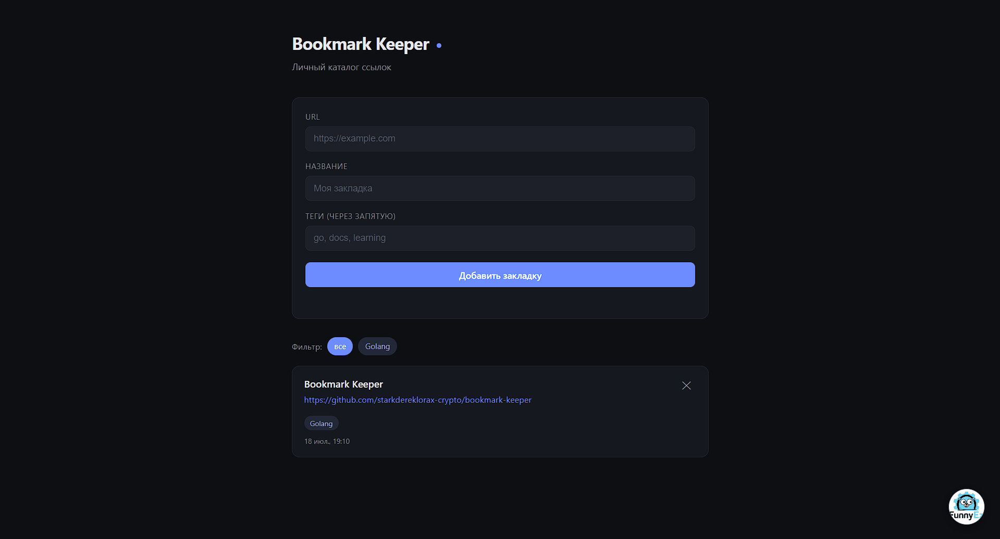

# Bookmark Keeper

Личный каталог ссылок: REST API на Go + веб-интерфейс(создан с помощью Claude). Позволяет сохранять закладки с тегами, просматривать их, фильтровать по тегам и удалять. Данные сохраняются на диск и переживают перезапуск сервера.



## Возможности

- Добавление, просмотр и удаление закладок
- Теги и фильтрация по ним
- Хранение данных в JSON-файле (персистентность между запусками)
- Тёмный минималистичный интерфейс
- Потокобезопасное хранилище (`sync.RWMutex`)

## Технологии

- **Go** (стандартная библиотека, без внешних зависимостей)
- Роутинг на `net/http` с паттернами Go 1.22
- Фронтенд — ванильный HTML/CSS/JS

## Запуск

Требуется Go 1.22 или новее.

```bash
git clone https://github.com/starkdereklorax-crypto/bookmark-keeper.git
cd bookmark-keeper
go run ./cmd/server
```

Сервер запустится на порту `8080`. Открой в браузере:

```
http://localhost:8080
```

Порт можно переопределить через переменную окружения `PORT`:

```bash
PORT=3000 go run ./cmd/server
```

> Запускать сервер нужно из корня проекта — фронтенд (папка `web`) и файл данных (`bookmarks.json`) ищутся по относительному пути.

## API

| Метод  | Путь               | Описание                     | Ответ            |
|--------|--------------------|------------------------------|------------------|
| POST   | `/bookmarks`       | Создать закладку             | `201` + закладка |
| GET    | `/bookmarks`       | Список всех закладок         | `200` + массив   |
| GET    | `/bookmarks/{id}`  | Получить закладку по id      | `200` / `404`    |
| DELETE | `/bookmarks/{id}`  | Удалить закладку             | `204` / `404`    |

### Пример создания

```bash
curl -X POST localhost:8080/bookmarks \
  -d '{"url":"https://go.dev","title":"Go","tags":["go","docs"]}'
```

Ответ:

```json
{
  "id": 1,
  "url": "https://go.dev",
  "title": "Go",
  "tags": ["go", "docs"],
  "created_at": "2026-07-18T17:54:03+03:00"
}
```

### Валидация

- `url` — обязателен, должен начинаться с `http://` или `https://`
- `title` — обязателен, не пустой, до 100 символов
- `tags` — необязательны

Некорректные данные возвращают `400 Bad Request`.

## Структура проекта

```
bookmark-keeper/
├── cmd/server/         # точка входа
├── internal/
│   ├── models/         # структуры данных
│   ├── storage/        # хранилище + персистентность
│   └── handlers/       # HTTP-обработчики
└── web/                # фронтенд
```

## Автор

[FunnyEz](https://t.me/vah228)
